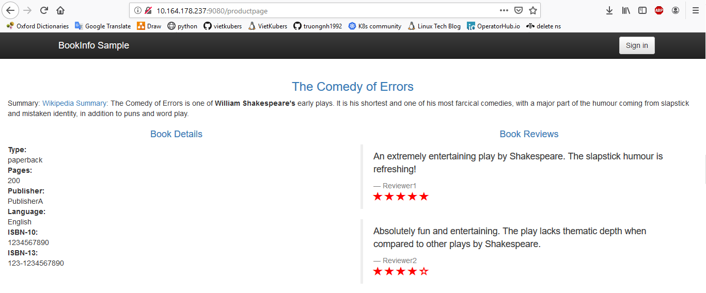

# Bare metal cluster with Kubernetes, Istio & MetalLB
This github repository is material of a presentation of VietKubers core-team at OpenInfra Days Vietnam 2019

## Requirements
>This lab is carried out on Ubuntu 16.04

#### 1. Install vagrant
```console
sudo apt install vagrant
```

#### 2. Install virtualbox
```console
sudo apt install virtualbox
```

## Setting up K8s cluster 

#### 1. Clone the repository `k8s-istio-metallb-hands-on-lab`
```console
git clone https://github.com/vietkubers/k8s-istio-metallb-hands-on-lab.git
```
#### 2. Create VMs for K8s nodes
```console
cd k8s-istio-metallb-hands-on-lab/k8s-cluster
vagrant up
```
After the vagrant work has done, there are 3 VMs up. Now we will set up K8s cluster with 1 `Master node` and 2 `Worker nodes`. Remote to VMs by command:
```console
vagrant ssh k8s-master (or k8s-worker1 / k8s-worker2)
```

#### 3. Deploying K8s cluster

**3.1. Deploying Master node (In case of using flannel overlay network)**
```console
sudo kubeadm init --apiserver-advertise-address=<PRIVATE-MASTER-IP> --pod-network-cidr=10.244.0.0/16
```
In this lab, \<PRIVATE-MASTER-IP\>=192.168.205.10

**3.2. Start using cluster**
```console
mkdir -p $HOME/.kube
sudo cp -i /etc/kubernetes/admin.conf $HOME/.kube/config
sudo chown $(id -u):$(id -g) $HOME/.kube/config
```

**3.3. Applying a pod network**
```console
kubectl apply -f https://raw.githubusercontent.com/coreos/flannel/bc79dd1505b0c8681ece4de4c0d86c5cd2643275/Documentation/kube-flannel.yml
```

**3.4. Joining `k8s-worker1` and `k8s-worker2` to the cluster**
```console
sudo kubeadm join <PRIVATE-MASTER-IP>:6443 --token <token> --discovery-token-ca-cert-hash sha256:<hash>
```

## Installing LoadBalancer
Let deploy [`MetalLB`](https://metallb.universe.tf/) in order to access Bookinfo App from outside of the cluster.


```console
kubectl apply -f https://raw.githubusercontent.com/google/metallb/v0.7.3/manifests/metallb.yaml
```

This will deploy MetalLB to K8s cluster, under the `metallb-system` namespace.

#### Setting up bgp router (For BGP mode)

1. create bgp router with vyos
```console
cd k8s-istio-metallb-hands-on-lab/k8s-cluster
vagrant up
```
2. setting bgp router
``` console
vagrant ssh bgp-router
configure
set protocols bgp 64512
set protocols bgp 64512 parameters router-id 192.168.205.1
set protocols bgp 64512 neighbor 192.168.205.11 remote-as 64512
set protocols bgp 64512 neighbor 192.168.205.12 remote-as 64512
set protocols bgp 64512 maximum-paths ibgp 2
commit
save
exit
```
3. Show bgp configure
``` console
show ip bgp neighbors
```

#### Allocate external Ips for loadbalancer

[ARP Mode] Creating `configmap.yaml`, the following configuration gives MetalLB control over IPs from `192.168.205.15` to `192.168.205.50`

```yaml
apiVersion: v1
kind: ConfigMap
metadata:
  namespace: metallb-system
  name: config
data:
  config: 
    address-pools:
    - name: default
      protocol: layer2
      addresses:
      - 192.168.205.15-192.168.205.50
```

[BGP mode] Creating `configmap.yaml` as below:

```yaml
apiVersion: v1
kind: ConfigMap
metadata:
  namespace: metallb-system
  name: config
data:
  config: |
    peers:
    - peer-address: 192.168.205.1
      peer-asn: 64512
      my-asn: 64512
    address-pools:
    - name: default
      protocol: bgp
      addresses:
      - 192.168.205.224/27
```

#### Apply configuration
```console
kubectl apply -f configmap.yaml
kubectl get pods -n metallb-system

NAME                          READY   STATUS    RESTARTS   AGE   IP               NODE          NOMINATED NODE   READINESS GATES
controller-7cc9c87cfb-5v7dg   1/1     Running   0          32m   10.244.2.33      k8s-worker3   <none>           <none>
speaker-6ptpj                 1/1     Running   0          32m   192.168.205.11   k8s-worker1   <none>           <none>
speaker-nd6qb                 1/1     Running   0          32m   192.168.205.12   k8s-worker2   <none>           <none>
```

## Installing Istio

#### 1. Download Istio

```console
curl -L https://git.io/getLatestIstio | ISTIO_VERSION=1.1.0 sh -
```

#### 2. Install all the Istio Custom Resource Definitions (CRDs)
```console
cd istio-1.1.0
for i in install/kubernetes/helm/istio-init/files/crd*yaml; do kubectl apply -f $i; done
```

#### 3. Install istio-demo
```console
kubectl apply -f install/kubernetes/istio-demo.yaml
```


## Installing Bookinfo application

#### 1. Label the namespace that will host the application with `istio-injection=enabled`
```console
kubectl label namespace default istio-injection=enabled
```

#### 2. Deploy Bookinfo application

Deploying Bookinfo with multiple replicas. Changing all replicas from 1 to 2 and adding `type: LoadBalancer` below spec of **Productpage services** in `samples/bookinfo/platform/kube/bookinfo.yaml`.

```yaml
##################################################################################################
# Productpage services
##################################################################################################
apiVersion: v1
kind: Service
metadata:
  name: productpage
  labels:
    app: productpage
    service: productpage
spec:
  ports:
  - port: 9080
    name: http
  selector:
    app: productpage
  type: LoadBalancer
```

```console
kubectl apply -f samples/bookinfo/platform/kube/bookinfo.yaml
```

Confirm all services are correctly defined and running.

```console
master@k8s-master:~/istio-1.1.0$ sudo kubectl get svc
NAME          TYPE           CLUSTER-IP       EXTERNAL-IP      PORT(S)          AGE
details       ClusterIP      10.100.126.18    <none>           9080/TCP         19m
kubernetes    ClusterIP      10.96.0.1        <none>           443/TCP          4h57m
productpage   LoadBalancer   10.105.200.30    192.168.205.16   9080:30118/TCP   19m
ratings       ClusterIP      10.110.246.171   <none>           9080/TCP         19m
reviews       ClusterIP      10.103.133.5     <none>           9080/TCP         19m
```

To confirm that the Bookinfo application is running.
```console
kubectl exec -it $(kubectl get pod -l app=ratings -o jsonpath='{.items[0].metadata.name}') -c ratings -- curl productpage:9080/productpage | grep -o "<title>.*</title>"

<title>Simple Bookstore App</title>
```

#### 3. Confirm the app is accessible from outside the cluster
Using web browser and goto [`http://192.168.205.16:9080/productpage`](http://10.164.178.237:9080/productpage) or:
```console
curl -s http://192.168.205.16:9080/productpage | grep -o "<title>.*</title>"

<title>Simple Bookstore App</title>
```

